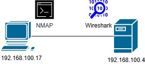
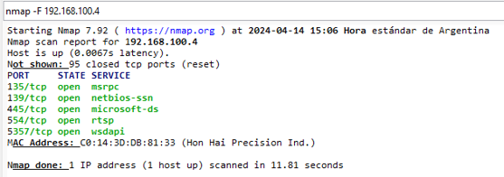
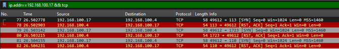
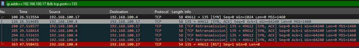
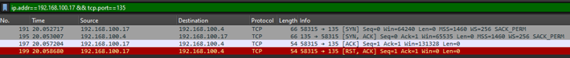

## Nmap: análisis de tráfico con Wireshark
# Introducción
En este laboratorio vamos a analizar qué sucede en la red cuando se realiza un escaneo con Nmap sobre un objetivo. Las capturas se harán con Wireshark corriendo sobre la máquina objetivo 

## Captura de datos

Comenzamos ejecutando Wireshark y en la PC víctima y comenzamos el análisis en el PC atacante con Nmap, ejecutando `nmap -F -sS 192.168.100.4`. Este tipo de escaneo se conoce como "semi abierto" o "SYN scan", porque no completa el saludo de las tres vías. 
El resultado nos mostrará los puertos abiertos en la PC objetivo. Se utiliza en la fase de reconocimiento, para identificar servicios accesibles. 

Ahora observamos la captura de Wireshark, en la víctima. Utilizamos el filtro de Wireshark `ip.addr==192.168.100.17 && tcp`. Observamos los mensajes `SYN` que envía Nmap hacia el objetivo. Cuando la víctima responde con  `RST` significa que el puerto está cerrado. 

Veremos a continuación, el comportamiento con uno de los puertos abiertos. Para estos, afinamos el filtro utilizado anteriormente para mostrar el resultado de un solo puerto, por ejemplo el 135: `ip.addr==192.168.100.17 && tcp.port==135`. El puerto recibe la solicitud `SYN` del atacante, y responde según el saludo de las tres vías con un `SYN - ACK `. El proceso debería completarse con un ACK de parte del origen para establecer la comunicación. En cambio, el origen (el host con Nmap) no responde nada y el host destino cierra la comunicación al no recibir respuesta con un `RST`. 

Este tipo de escaneo se conoce como "sigiloso", aunque esto no significa que sea indetectable: un IDS(IPS puede reconocer estos intentos de conexión. 

Se puede realizar un escaneo completo ejecutando el comando `nmap -sT -F 192.168.100.4`. En este caso, el origen responde la solicitud `SYN - ACK` y establece la conexión con el puerto destino. Una vez confirmado que el puerto está abierto, Nmap envía un `RST` solicitando el cierre de la conexión. Este tipo de escaneos ser utilizado cuando no se tienen privilegios para generar paquetes TCP. Al completar la conexión, puede producir más registros. 

## ¿Cómo detecta un firewall un escaneo de puertos?

Un firewall con detección de intrusiones puede identificar patrones característicos del reconocimiento de puertos. Por ejemplo, múltiples paquetes `SYN` de una misma Ip hacia diferentes puertos, una cantidad elevada de conexiones fallidas o conexiones que se cierran inmediatamente después de establecerse. 
Se suele combinar firmas de detección y umbrales de actividad. Un SYN Scan puede detectarse porque el saludo de las tres vías no se completa. Sin embargo, no toda conexión incompleta ni todo escaneo constituye un ataque. Un pentest autorizado o una herramienta de inventario podría producir tráfico similar. 

