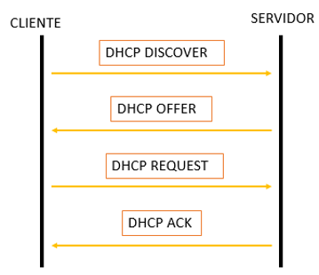
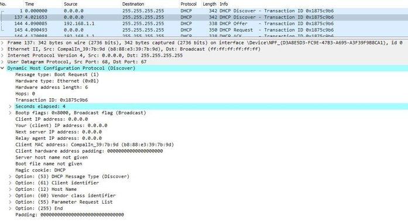
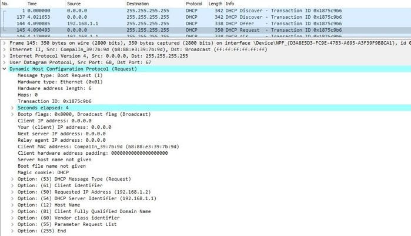
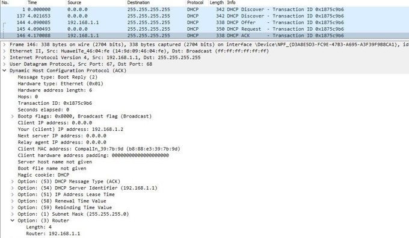
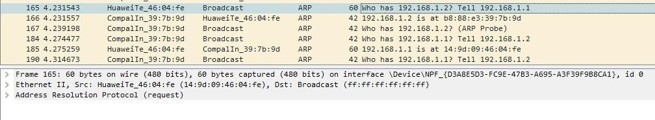

# DHCP
DHCP es un protocolo de asignación dinámica de direcciones IP, con la cual los dispositivos pueden asignarse automáticamente dirección IP, máscara, default gateway, servidor DNS y otros parámetros. El servidor "alquila" a los clientes una dirección por un determinado tiempo. Una vez finalizado ese período, la dirección puede ser reutilizada. 
El proceso de asignación se puede ver en la imagen siguiente, con los 4 mensajes enviados entre cliente y servidor. 

En este laboratorio, vamos a analizar cómo un host se comunica con un servidor DHCP para obtener información de direccionamiento. Para capturar este proceso utilizaremos Wireshark para capturar la comunicación entre cliente y servidor.

## DHCP DISCOVER
El cliente se conecta a la red. Envía un broadcast con IP destino 255.255.255.255 puerto destino 67. Como origen, utiliza la dirección 0.0.0.0:68. 
Esta solicitud llegará a todos los dispositivos dentro de la misma subred, pero solo será atendida si existe un servidor DHCP escuchando el puerto 67. 

## DHCP OFFER
El servidor DHCP tiene configurado un pool de direcciones, las cuales deberá ofrecer a los clientes. Cuando recibe el DHCP DISCOVER, el servidor realiza una oferta al cliente, con una IP del pool mediante un DHCP OFFER. El servidor reserva esta IP a la MAC del cliente, y no la ofrece a ninguna otra solicitud.

## DHCP REQUEST
El cliente informa al servidor que acepta su oferta

## DHCP ACK
El servidor crea una entrada que vincula la MAC del cliente con la IP arrendada. Tanto cliente como servidor chequean que la IP no esté en uso (mediante búsqueda ARP o ICMP).

Antes que caduque el arrendamiento, el cliente enviará un mensaje DHCP REQUEST para renovarlo. El servidor devuelve con un DHCP ACK y renueva el tiempo de leasing.
