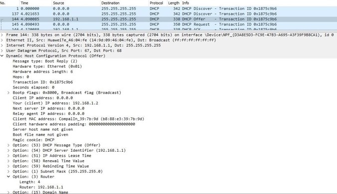
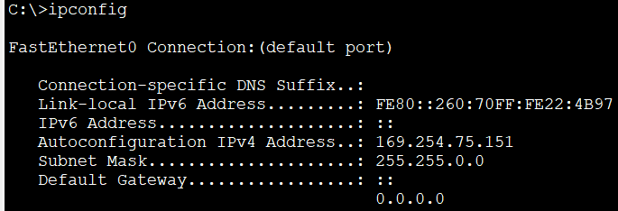

# DHCP
DHCP es un protocolo de asignación dinámica de direcciones IP, con la cual los dispositivos pueden asignarse automáticamente dirección IP, máscara, default gateway, servidor DNS y otros parámetros. El servidor "alquila" a los clientes una dirección por un determinado tiempo. Una vez finalizado ese período, la dirección puede ser reutilizada. 
El proceso de asignación se puede ver en la imagen siguiente, con los 4 mensajes enviados entre cliente y servidor. 

En este laboratorio, vamos a analizar cómo un host se comunica con un servidor DHCP para obtener información de direccionamiento. Para capturar este proceso utilizaremos Wireshark para capturar la comunicación entre cliente y servidor.
Antes de conectar la computadora a la red, iniciamos la captura en Wireshark. Luego conectamos el equipo y esperamos a que se complete el proceso. Una vez realizado, usamos el filtro `dhcp` para observar solo los paquetes que nos interesan.

## DHCP DISCOVER
El cliente se conecta a la red. Envía un broadcast con IP destino `255.255.255.255` puerto destino `67`. Como origen, utiliza la dirección `0.0.0.0:68`. 
Esta solicitud llegará a todos los dispositivos dentro de la misma subred, pero solo será atendida si existe un servidor DHCP escuchando el puerto 67. 

## DHCP OFFER
El servidor DHCP tiene configurado un pool de direcciones, las cuales deberá ofrecer a los clientes. Cuando recibe el DHCP DISCOVER, el servidor realiza una oferta al cliente, con una IP del pool mediante un DHCP OFFER. El servidor reserva esta IP a la MAC del cliente, y normalmente evita ofrecerla a otro dispositivo, mientras espera la confirmación.

## DHCP REQUEST
El cliente informa al servidor que acepta su oferta

## DHCP ACK
El servidor crea una entrada que vincula la MAC del cliente con la IP arrendada. 

Antes de completarse la asignación, pueden realizarse mecanismos de detección de conflictos. El servidor puede verificar previamente que la dirección ofrecido no esté siendo utilizada, por ejemplo mediante ICMP. Una vez recibido el DHCPACK, el cliente puede realizar una comprobación adicional con ARP. Si detecta que la dirección está en uso, puede enviar un mensaje al servidor para declinar la oferta. 

Antes que caduque el arrendamiento, el cliente enviará un mensaje DHCP REQUEST para renovarlo. El servidor devuelve con un DHCP ACK y renueva el tiempo de leasing.

## Qué sucede si DHCP falla
Si el cliente no logra encontrar un servidor DHCP en la red, Windows puede asignar automáticamente una dirección IP APIPA. Estas direcciones pertenecen al rango `169.254.0.0/16`. La presencia de una dirección APIPA suele indicar que el proceso DHCP no pudo completarse correctamente.
En el cliente podemos verificar el direccionamiento desde el cmd con `ipconfig`

## Conclusión
Durante el laboratorio se analizó el proceso de asignación de direccionamiento, conocido también como DORA (por las iniciales de los mensajes Discovery, Offer, Request y ACK). Se logró capturar el tráfico DHCP utilizando Wireshark. En las capturas fue posible identificar las cuatro etapas que permiten a un cliente obtener parámetros de red en forma automática. 
Las capturas y el análisis de este intercambio resulta útil para comprender el funcionamiento del protocolo como así también para diagnosticar problemas de asignación de direcciones IP. 
