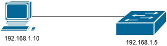
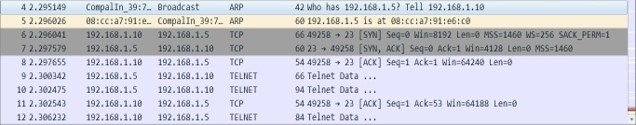
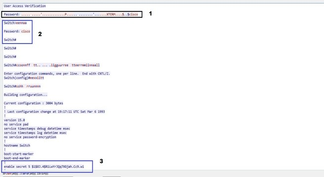
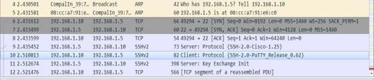
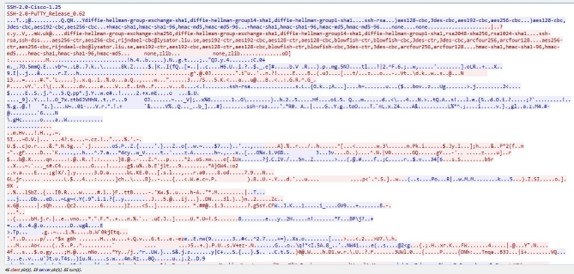
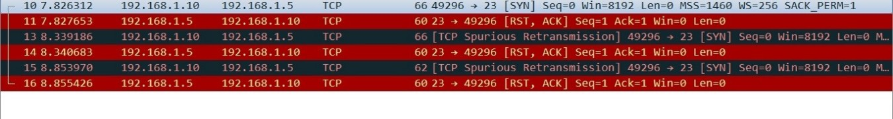

# Telnet vs SSH

## Introducción
Telnet y SSH son protocolos utilizados para administrar en forma remota dispositivos como switches, routers, servidores. La diferencia, es que SSH envía el tráfico cifrado, mientras telnet lo hace en texto plano.
Esto significa que si alguien captura el tráfico, podrá leer todo el contenido de la conversación. En este laboratorio, se busca capturar el tráfico telnet y SSH para observar la diferencia. 
Para esto, se realizó una topología simple con una PC y un switch Cisco 2960 configurado con sus parámetros básicos para administrar por telnet. 



## Telnet
El switch fue configurado con los parámetros básicos, a través de la conexión por consola: 

```bash
! líneas omitidas por brevedad
hostname Switch
!
enable secret 5 $1$mERr$hx5rVt7rPNoS4wqbXKX7m0
!
interface Vlan1
ip address 192.168.1.5 255.255.255.0
!
!
line con 0
!
line vty 0 4
password cisco
login
line vty 5 15
password cisco
login
!
End
```
No se utilizó el comando `service password-encryption`, por lo que la contraseña VTY aparece en texto plano. Para la contraseña en modo privilegiado se utilizó el comando `enable secret [password]`, para que en la salida del `show running-config` se vea cifrada. 
Una vez configurado el switch, conectamos nuestra PC y le configuramos una IP en el rango de la interface VLAN 1 del switch, en este caso 192.168.1.0/24. 
Nos conectamos al switch con un emulador de terminal, como el Putty. Abrimos el Wireshark e iniciamos la captura. Una vez aceptada la conexión, nos pedirá la contraseña (la que configuramos en line vty del switch). 
Al aceptar, quedamos en el modo usuario. Pasamos al modo privilegiado con el comando `enable` y ponemos la contraseña que configuramos para el modo privilegiado. 
```bash
Switch > enable
Password:
Switch#
```
Tipeamos algunos comendos, por ejemplo `show running-config`, pasamos las diferentes pantallas para ver toda la configuración y salimos. Detenemos la captura en Wireshark y pasamos a analizar qué vemos. 



Las primeras dos líneas corresponden a ARP, donde la PC averigua la MAC asociada a la IP del switch. Luego, inicia el enlace de las 3 vías, ya que telnet es un protocolo que utiliza TCP. 
Se observan los tres mensajes (`SYN, SYN-ACK, ACK`) y luego comienza el tráfico telnet. Nos paramos con el mouse y seleccionamos cualquiera de los paquetes telnet y hacemos click derecho sobre él.
Elegimos la opción `Follow > TCP stream`



En 1 podemos ver la contraseña VTY en texto plano. Luego, en 2 el comando `enable` y la contraseña también en texto plano. En 3 vemos la contraseña de modo privilegiado cifrado. 
Con esto verificamos que el comando `enable secret` almacena las contraseñas como un hash, y solo la protege dentro de la configuración del dispositivo. Estos comandos no cifran una sesión telnet. 
De esta forma, vemos la necesidad de utilizar un método de acceso remoto más seguro, como SSH. 

## SSH
Para habilitar SSH en un switch Cisco hay que agregar algunos parámetros.
```bash
! lineas omitidas por brevedad
! hostname SW1
!
enable secret 5 $1$mERr$hx5rVt7rPNoS4wqbXKX7m0
!
! 
ip domain-name lab.com
username admin secret 5 $1$mERr$hx5rVt7rPNoS4wqbXKX7m0
crypto key generate rsa modulus 2048
ip ssh version 2
!
interface Vlan1
ip address 192.168.1.5 255.255.255.0
! 
line vty 0 4
login local
transport input ssh
line vty 5 15
login local
transport input ssh
!
End
```
Se debe configurar un hostname y dominio al equipo. Configuramos un usuario y contraseña, que serán las credenciales que se utilizarán para acceder al equipo. Con el comando `crypto key generate` generamos las claves RSA.
Se habilitó SSH versión 2 y en line VTY no se configuraron contraseñas. En cambio, se utiliza el comando `login local` para que el switch solicite las credenciales configuradas previamente (usuario y contraseña). 
Con `transport input ssh` le decimos al switch que solo acepte conexiones SSH. 
Comenzamos la captura en Wireshark y nos conectamos al switch con el Putty como lo hicimos en el caso anterior, pero ahora utilizando SSH. 
Una vez dentro, ejecutamos unos comandos y cerramos la conexión. 
Al analizar la captura, vemos primero la solicitud de ARP y el enlace de las 3 vías, ahora hacia el puerto 22. Luego, el tráfico SSH. 



Seleccionamos uno de los paquetes SSH y elegimos `Follow > TCP stream` como lo hicimos antes. 



Todo el tráfico está cifrado. 
Por último, quedaría probar qué sucede cuando queremos conectarnos por telnet.



La PC quiere iniciar el saludo de las tres vías de TCP enviando un SYN al puerto 23 del switch. Como habíamos configurado previamente que sólo acepte conexiones SSH, el switch rechaza la conexión y envía el flag RST cerrando la conexión. 

